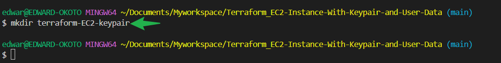
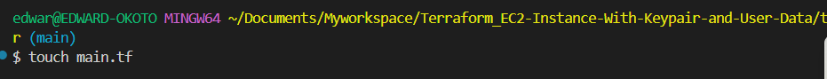
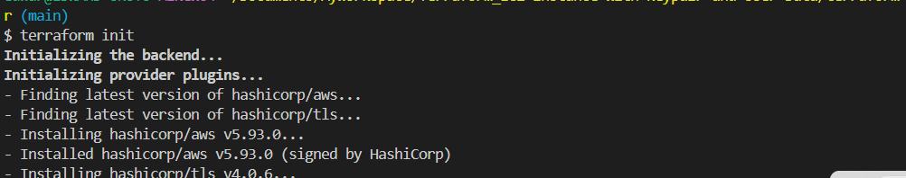
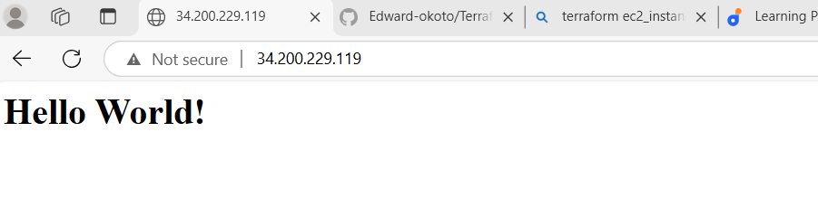

# Terraform_EC2-Instance-With-Keypair-and-User-Data

### Project

Terraform to automate the launch of an EC2 instance on AWS. The project includes the generation of a downloadable key pair for the instance and the execution of the user data script to install and Configure Apache HTTP server.

---

## Objectives

1.Terraform Configuration.

- We will learn to write Terraform code to launch an EC2 instance with specified configurations.

2.Key Pair Generation.

- Generate a key pair and make it downloadable after EC2 instance creation.

2.User Data Execution

- Use terraform to execute a user data script on the EC2 instance during launch.

### Project Task:

### Task 1: Terraform configuration for EC2 Instance.

1.Create a new directory for your Terraform project `terraform-EC2-keypair`
```
mkdir terrafor-EC2-keypair
```


2.Create a new file inside your directory `main.tf`
```
touch main.tf
```


3.Write a terraform code to create an EC2 instance with the following specifications.

- Instance type : `t2.micro`
- Key-pair : Generate a new key pair and make it downloadable.
- Security group: Allow incoming traffic on port 80


### Terraform Code:

```hcl
provider "aws" {
  region = "us-east-1"
}

data "aws_ami" "ubuntu" {
  most_recent = true

  filter {
    name   = "name"
    values = ["ubuntu/images/hvm-ssd/ubuntu-jammy-22.04-amd64-server-*"]
  }

  filter {
    name   = "virtualization-type"
    values = ["hvm"]
  }

  owners = ["099720109477"]  # Canonical's AWS account ID
}

resource "tls_private_key" "generated" {
  algorithm = "RSA"
  rsa_bits  = 2048
}

resource "aws_key_pair" "new_key_pair" {
  key_name   = "auto-generated-key-pair"
  public_key = tls_private_key.generated.public_key_openssh
}

resource "aws_security_group" "allow_http" {
  name_prefix = "allow-http-"

  ingress {
    from_port   = 80
    to_port     = 80
    protocol    = "tcp"
    cidr_blocks = ["0.0.0.0/0"]
  }

  egress {
    from_port   = 0
    to_port     = 0
    protocol    = "-1"
    cidr_blocks = ["0.0.0.0/0"]
  }
}

resource "aws_instance" "example_instance" {
  ami           = data.aws_ami.ubuntu.id  # Dynamically fetch the latest Ubuntu AMI
  instance_type = "t2.micro"
  key_name      = aws_key_pair.new_key_pair.key_name

  security_groups = [
    aws_security_group.allow_http.name
  ]

  tags = {
    Name = "ExampleInstance"
  }
}

output "private_key" {
  value     = tls_private_key.generated.private_key_pem
  sensitive = true
}

output "key_name" {
  value = aws_key_pair.new_key_pair.key_name
}
```

#### What Happens in This Code with respect to the key?

**Private Key Generation**: The `tls_private_key` resource generates an RSA key pair. The public key is sent to AWS to create a new key pair.

**Private Key Output**: The private key is stored locally in the Terraform output. Marking it as `sensitive` ensures it's not displayed in the Terraform logs but is available for you to download securely.

**EC2 Instance Configuration**: The newly generated key pair is associated with the instance.

#### Next Steps:
 **Download the Private Key**:
   After running `terraform apply`, Terraform will provide the private key in the output. You can save it locally for future use.

**Set Proper Permissions**:
   Save the private key file with restricted permissions (e.g., `chmod 400 your-key-file.pem`) to ensure secure SSH connections.


4.Initialize the terraform project using the command `terraform init`



5.Apply the terraform configuration to create the EC2 instance using the command `terraform apply`


**Task 2: User Data Script Execution**

1.Extend your Terraform configuration to include the execution of the provided user data script
```
# User Data Script
  user_data = <<-EOF
              #!/bin/bash
              # Update package manager
              sudo apt-get update
              
              # Install Apache HTTP Server
              sudo apt-get install -y apache2
              
              # Enable Apache to start on boot
              sudo systemctl enable apache2
              
              # Start Apache Service
              sudo systemctl start apache2
              
              # Create HTML Page to Serve
              echo "<html><h1>Hello World!</h1></html>" > /var/www/html/index.html
              EOF

```

2.Apply the updated Terraform configuration to launch the EC2 instance with the user data script using the command `terraform apply`

**task 3: Accessing The Web Server**

Include an output to return the public ip of the instance:

update the terraform code:

```
output "public_ip" {
  value = aws_instance.example_instance.public_ip
}
```

After the EC2 instance is created and running,access the apache web server by using the public ip address

verify that the web server displays the Hellow world message generated by the user data script

